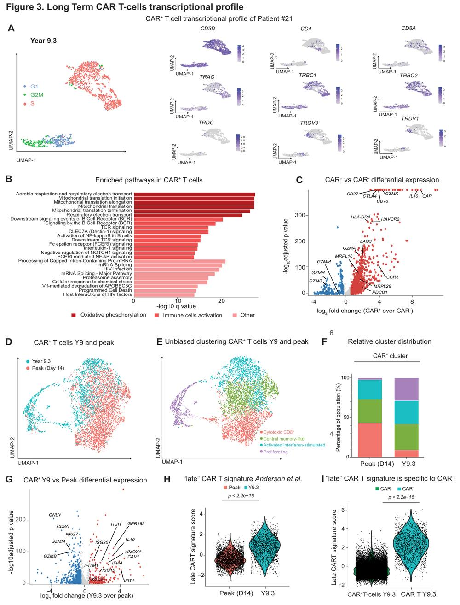

# Computational Cancer Immunology

**CAR-T Cell Therapy · Single-Cell Genomics · TCR Repertoire · Translational Bioinformatics**

Research Assistant, Penn Medicine  
M.S.E. Bioengineering, University of Pennsylvania

 

  

*Using high-dimensional molecular and immune data to study cell state, clonal dynamics, and therapeutic response.*

---

## Featured Publication

<table>
<tr>
<td width="48%" valign="top">

<i>Figure 3 · <b>Nature Medicine</b> (2026)</i>

</td>
<td width="52%" valign="top">

### **Decade-long persistence of CD19 CAR T cells in B cell lymphomas**

**Nature Medicine · 2026**

Long-term CAR-T transcriptional states and immune-repertoire evolution using single-cell transcriptomics and TCR analysis.

 

 

**Figure 3** highlights the long-term CAR-T transcriptional profile, including cell-cycle state, pathway enrichment, differential expression, and peak-versus-year-9.3 comparisons.

</td>
</tr>
</table>
---

## Research

<table>
<tr>
<td width="33%" valign="top">

### CAR-T & Tumor Immunology

Long-term persistence, cell-state evolution, treatment response, exhaustion, memory, and translational cellular therapy.

</td>
<td width="33%" valign="top">

### Single-Cell & Immune Repertoire

scRNA-seq, longitudinal TCR clonotypes, repertoire diversity, cell-state annotation, regulon activity, and pathway analysis.

</td>
<td width="33%" valign="top">

### Translational Genomics

Cancer genomics, survival modeling, proteomics, bulk transcriptomics, and integration of molecular and clinical data.

</td>
</tr>
</table>

---

## Selected Research Code

<table>
<tr>
<td width="50%" valign="top">

### [GSE311890-CART-analysis](https://github.com/EDCAKDC/GSE311890-CART-analysis)

Long-term CAR-T persistence and immune-repertoire evolution.

**scRNA-seq · TCR · Harmony · differential expression · pySCENIC**

</td>
<td width="50%" valign="top">

### [tcr-clonotype-analysis](https://github.com/EDCAKDC/tcr-clonotype-analysis)

Integration of transcriptomic cell states with T-cell receptor clonotypes.

**Seurat · scRepertoire · Harmony · clonotype tracking**

</td>
</tr>

<tr>
<td width="50%" valign="top">

### [metabolic-systems-biology](https://github.com/EDCAKDC/metabolic-systems-biology)

Constraint-based modeling of T-cell metabolism under tumor-microenvironment conditions.

**COBRApy · FBA/FVA · E-Flux · perturbation analysis**

</td>
<td width="50%" valign="top">

### [Machine-Learning](https://github.com/EDCAKDC/Machine-Learning)

Biomedical tabular classification benchmark with model interpretation.

**model comparison · hyperparameter tuning · SHAP**

</td>
</tr>
</table>

### Methods-oriented repositories

---

<b>Selected computational methods</b>

 

| Domain | Methods & frameworks |
|---|---|
| **Single-cell & repertoire** | Seurat · Harmony · scRepertoire · pySCENIC · cell-state annotation · clonotype analysis |
| **Transcriptomics** | DESeq2 · edgeR · limma · STAR · featureCounts · Salmon · GSEA |
| **Cancer & regulatory genomics** | mutation/VAF analysis · MACS2 · ChIPseeker · genomic interval analysis |
| **Flow cytometry** | FlowSOM · UMAP · cluster-abundance analysis · density visualization |
| **Systems biology** | COBRApy · FBA · FVA · knockout analysis · E-Flux |
| **Statistical modeling** | generalized linear models · survival analysis · multiple-testing correction |
| **Scientific computing** | R · Python · Bash · Linux · Conda · Git |

---

## Research Interests

**Computational cancer immunology · CAR-T biology · single-cell genomics**  
**TCR repertoire analysis · translational bioinformatics · cancer genomics · multi-omics**

---

## Reproducible Research

I aim to keep computational analyses **clear, modular, and reproducible**. Public repositories contain code and documentation where data-sharing permissions allow; large or controlled-access datasets are referenced through their original repositories or accession numbers.

 

**Penn Medicine · University of Pennsylvania**

